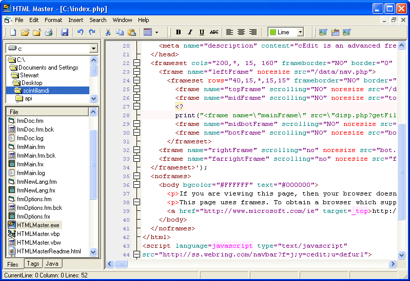



## HTML Master \(Generic HTML Editor utilizing Scintilla Wrapper\)

### Description

This is a generic HTML editor written in VB utilizing the Scintilla Wrapper class I wrote a while back. I wrote it for two reasons. To test and debug the wrapper and to demonstrate some of the abilities of the wrapper class. This app features a table designer, image designer, link designer, quick table, find, replace, goto, etc. Utilizing some of the wrappers built in support it does things like maintain the column even when inserting a large block of code. Hope you guys enjoy it PS You can download it with the scintilla DLL from http://www.ceditmx.com/scintillahtml.zip. You will need the scintilla dll also available at http://www.scintilla.org. :)
 
### More Info
 
You can download it with the scintilla DLL from http://www.ceditmx.com/scintillahtml.zip. You will need the scintilla dll also available at http://www.scintilla.org. :)

             |
---                |---
**Submitted On**   |2005-12-10 09:50:10
**By**             |[Stewart](https://github.com/Planet-Source-Code/PSCIndex/blob/master/ByAuthor/stewart.md)
**Level**          |Intermediate
**User Rating**    |4.9 (39 globes from 8 users)
**Compatibility**  |VB 5\.0, VB 6\.0
**Category**       |[Complete Applications](https://github.com/Planet-Source-Code/PSCIndex/blob/master/ByCategory/complete-applications__1-27.md)
**World**          |[Visual Basic](https://github.com/Planet-Source-Code/PSCIndex/blob/master/ByWorld/visual-basic.md)
**Archive File**   |[HTML\_Maste19555912102005\.zip](https://github.com/Planet-Source-Code/stewart-html-master-generic-html-editor-utilizing-scintilla-wrapper__1-63596/archive/master.zip)

